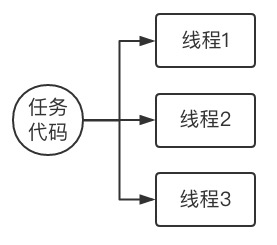
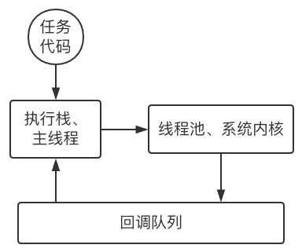
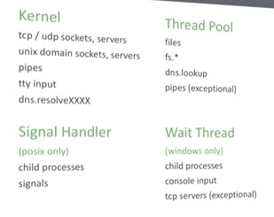
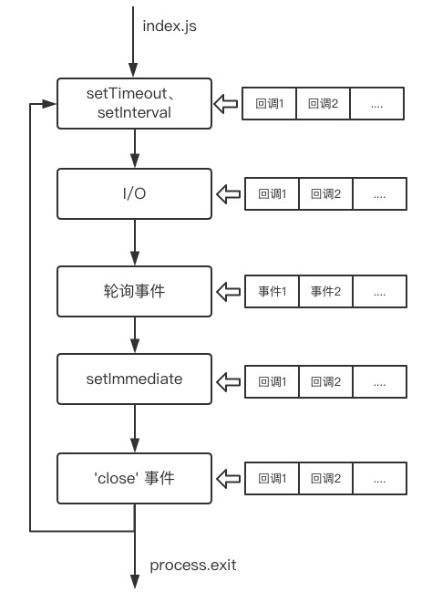
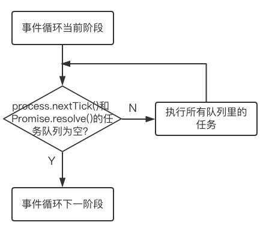

# 并发模型
常见的并发模型是并行工作者模型，任务分配给多个工作者，每个工作者完成整个任务，常说的 C 语言的多线程就是这种模型，它的工作模式如下图。



而 Node.js 用的并发模型是事件驱动模型，工作者对出现的事件做出反应，自身也能产生事件，它的工作模式如下图。



# 单线程、同异步
常说的 JavaScript 的单线程指的是用户代码执行上的单线程，即同一时间只能执行一段代码，这与 C 语言同一时间可以并行执行多段代码形成鲜明的对比。
所以 Node.js 的执行可以简单地分成两个阶段：
* 初始化代码执行
* 事件循环

初始化代码执行里，执行所有的同步操作代码。所谓同步操作，就是永远一步步执行、没有结果不继续执行后面代码的操作。对应的异步操作是不等待结果就继续执行后面代码的操作。一般异步操作都带有一个回调函数，而回调函数里的操作不包括在上面说的「后面代码」里，而是异步操作完成以后希望要执行的操作，它们需要排队等待被执行。

异步操作的回调函数排队等待被执行就算在事件循环这一阶段。在执行完所有同步代码以后，Node.js 查看回调队列里有没有任务，有的话就执行，没有的话就等待异步操作完成，因为带有回调任务的异步操作完成时会将回调任务入队到回调队列，这样就有任务可以执行了。所以可以很自然地推理出，如果回调队列为空且没有需要等待完成的异步操作，这个 Node.js 进程就结束了。事实也是如此。

由上也可以知道，所有的用户代码最终都是在同一线程也就是主线程上面顺序执行的。而回调函数就是执行顺序不是按声明顺序来执行而是要经过 Node.js 的事件循环来安排执行的用户代码。

# Node.js 异步操作的执行
我们知道 Node.js 的所有异步操作都是由 Libuv 来负责的。Libuv 将可以给系统内核来执行的异步操作都交给了系统内核来执行，只有当系统不能执行这个操作的时候才会用自己的线程池来执行这个异步操作。下图列出了一些异步操作一般由谁来执行：（图来自：[Morning Keynote- Everything You Need to Know About Node.js Event Loop - Bert Belder, IBM](https://www.youtube.com/watch?v=PNa9OMajw9w)）



# 事件循环顺序




如上图，每一个方框代表一个事件循环阶段，每一阶段都有自己的先进先出的任务队列。从用户代码入口开始，执行完所有同步代码后进入事件循环，在事件循环里的每一个阶段都查看该阶段的任务队列是否为空，如果不为空则尝试同步执行（以先进先出顺序一个一个执行）所有队列里的任务直到队列为空。这里轮询事件阶段的任务执行有最大次数限制。之后会细讲。

实际上事件循环里包含的阶段比图上列出的多，但是我们应该关心的都在图上列出来了。

### setTimeout、setInterval
由 `setTimeout` 、`setInterval` 调度的回调任务在这里排队执行。

### I/O
像是由网络、磁盘数据、子进程等 I/O 类调度的回调任务在这里排队执行。

### 轮询事件

查看是否有新的 I/O 事件，为下个轮询的 I/O 阶段提供任务。
如果所有队列为空，这里阻塞主线程进入沉睡，直到发生以下事件之一：
* 有新的 I/O 事件发生
* 有子线程完成任务
* 有定时器达到阈值

也就是说，上面的事件的发生都会进入这阶段的事件任务队列，当事件队列不为空时就执行到空或达到最大次数限制（因为这阶段在处理事件的时候可以产生新事件入队而导致队列一直不为空从而阻塞事件循环，所以有最大次数限制）。

### setImmediate
通过 `setImmediate` 设置的回调在这里排队执行。

### close 事件
 `on('close')` 事件调用的回调在这里排队执行。

# setTimeout/setImmediate
对于在非 I/O 回调里的 `setTimeout` 和 `setImmediate` 来说，执行的先后顺序无法确定，而在 I/O 回调里 `setImmediate` 总是比 `setTimeout` 先执行。
如在主模块里的这段代码：
```javascript
setTimeout(() => {
  console.log('in setTimeout')
}, 0)

setImmediate(() => {
  console.log('in setImmediate')
})
```
运行结果可能是：
```bash
in setTimeout
in setImmediate
```
也可能是：
```bash
in setImmediate
in setTimeout
```
而下面这段代码：
``` javascript
const fs = require('fs');

fs.readFile(filename, () => {
  setTimeout(() => {
    console.log('timeout');
  }, 0);
  setImmediate(() => {
    console.log('immediate');
  });
});
```
`setImmediate` 在 `setTimeout` 之前。

# 特殊的 process.nextTick() 和 Promise.resolve()
`process.nextTick()` 和 `Promise.resolve()` 不在上面的循环图里的阶段里面，它们也有一个自己的任务队列，在每个阶段结束的时候都会查看这个队列是否为空，如果不为空就一个个执行里面所有的任务直到队列为空。
执行逻辑大概如下图：


显然在递归调用 `process.nextTick()` 或 `Promise.resolve()` 的时候任务队列一直不为空则会引起阻塞，但是它们的存在又确实是必要的：
* 用户要在事件循环继续之前处理错误、清理资源
* 在当前执行栈之后且在事件循环之前需要执行一个回调

官方文档举了这样一个例子：
```javascript
const EventEmitter = require('events');
const util = require('util');

function MyEmitter() {
  EventEmitter.call(this);
  this.emit('event'); // 这里对 `event` 事件的监听还没运行到，则这个 emit 不能触发对应的回调
}
util.inherits(MyEmitter, EventEmitter);

const myEmitter = new MyEmitter();
myEmitter.on('event', () => {
  console.log('an event occurred!');
});
```
用了 `process.nextTick()` 后：
```javascript
const EventEmitter = require('events');
const util = require('util');

function MyEmitter() {
  EventEmitter.call(this);

  // 先执行了所有同步代码然后才执行 process.nextTick 的回调即 emit 一个 event 事件
  process.nextTick(() => {
    this.emit('event');
  });
}
util.inherits(MyEmitter, EventEmitter);

const myEmitter = new MyEmitter();
myEmitter.on('event', () => {
  console.log('an event occurred!');
});
```


**参考**：

[并发模型](http://ifeve.com/%E5%B9%B6%E5%8F%91%E7%BC%96%E7%A8%8B%E6%A8%A1%E5%9E%8B/)

[The Node.js Event Loop, Timers, and process.nextTick()](https://nodejs.org/en/docs/guides/event-loop-timers-and-nexttick/)

[What you should know to really understand the Node.js Event Loop](https://medium.com/the-node-js-collection/what-you-should-know-to-really-understand-the-node-js-event-loop-and-its-metrics-c4907b19da4c)

[Morning Keynote- Everything You Need to Know About Node.js Event Loop - Bert Belder, IBM](https://www.youtube.com/watch?v=PNa9OMajw9w)

[Understanding the Node.js Event Loop](https://blog.risingstack.com/node-js-at-scale-understanding-node-js-event-loop/)
